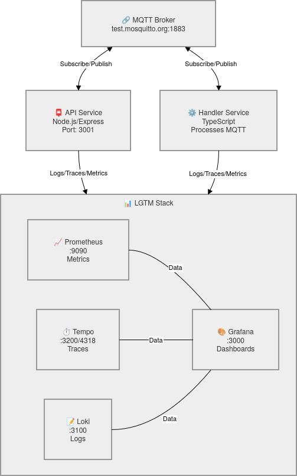

# MQTT LGTM Stack Demo

A full-stack observability project demonstrating inter-container communication via MQTT with comprehensive logging, tracing, and metrics collection using the LGTM stack (Loki, Grafana, Tempo, Prometheus).

## Project Scope

This project showcases:

- **Cross-service MQTT communication**: A JavaScript API service publishes messages to a TypeScript Handler service via MQTT (using public `test.mosquitto.org` broker)
- **Distributed tracing**: End-to-end trace visibility across both services using OpenTelemetry and Grafana Tempo
- **Log aggregation**: Centralized log collection with Grafana Loki
- **Metrics collection**: Performance metrics scraped by Prometheus
- **Unified observability**: All signals visualized in Grafana dashboards
- **CI/CD automation**: GitHub Actions workflows that build and push both services to GitHub Container Registry
- **Production-ready deployment**: Docker Compose setup for local development and VPS deployment

## Architecture



## Stack

- **Languages**: JavaScript (API), TypeScript (Handler)
- **Messaging**: MQTT via `test.mosquitto.org`
- **Observability**: OpenTelemetry, Prometheus, Loki, Tempo, Grafana
- **Containerization**: Docker & Docker Compose
- **CI/CD**: GitHub Actions → GitHub Container Registry
- **Deployment**: Docker Compose (local & VPS)

## Quick Start

```bash
# Clone and enter directory
git clone <repo>
cd <repo>

# Start local stack
docker-compose up -d

# Test API
curl -X POST http://localhost:3001/send \
  -H "Content-Type: application/json" \
  -d '{"message":"hello handler"}'

# Access Grafana
open http://localhost:3000  # admin/admin
```

## Observability & Dashboards

See [GRAFANA_SETUP_GUIDE.md](GRAFANA_SETUP_GUIDE.md) for comprehensive instructions on:
- Adding **Prometheus**, **Loki**, and **Tempo** data sources to Grafana
- Creating dashboards to visualize metrics, logs, and traces from your services
- Understanding what telemetry your application sends
- Example queries for common troubleshooting scenarios

## Services

| Service | Port | Purpose |
|---------|------|---------|
| API | 3001 | Express backend, publishes MQTT messages |
| Handler | - | Processes MQTT messages, sends responses |
| Prometheus | 9090 | Metric scraping & storage |
| Loki | 3100 | Log aggregation |
| Tempo | 3200/4318 | Trace collection (OTLP receiver) |
| Grafana | 3000 | Dashboards & visualization |

## Repository Structure

```
.
├── api/                              # JavaScript API service
│   ├── Dockerfile
│   ├── package.json
│   └── src/
├── handler/                          # TypeScript Handler service
│   ├── Dockerfile
│   ├── tsconfig.json
│   ├── package.json
│   └── src/
├── lgtm/                             # LGTM configuration
│   ├── prometheus.yml
│   ├── loki-config.yml
│   └── tempo-config.yml
├── .github/
│   └── workflows/
│       └── build-and-push.yml        # CI/CD pipeline
├── docker-compose.yml                # Local development
└── .deploy/
    └── docker-compose.prod.yml       # VPS production
```

## CI/CD Pipeline

On push to `main`, GitHub Actions automatically:
1. Builds Docker images for both services
2. Pushes to GitHub Container Registry (`ghcr.io`)
3. Tags with `latest` and commit SHA

## Deployment

**Local**: `docker-compose up -d`

**VPS**:
```bash
docker login ghcr.io
docker-compose -f .deploy/docker-compose.prod.yml up -d
```

---

**Note**: This is a demonstration project showcasing observability best practices with inter-service MQTT communication.